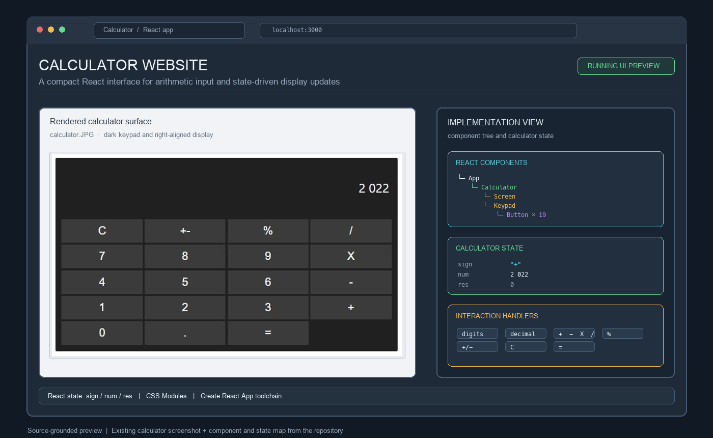
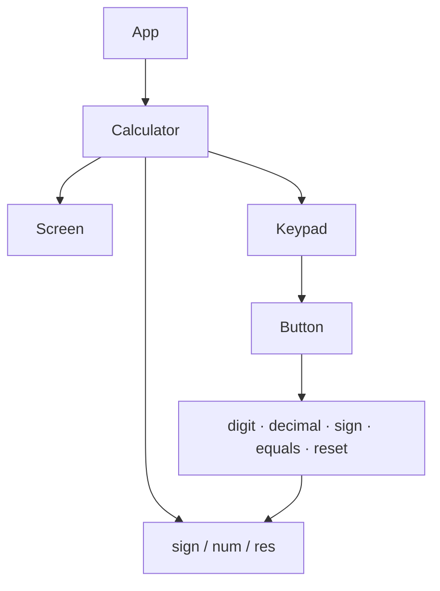

# React Calculator

> **Recommended repository name:** `react-calculator-ui`
>
> **About:** A React calculator with CSS Modules, a responsive four-column keypad, formatted display values, and state-driven arithmetic handlers.



## Overview

This project is a compact calculator application built with React. It renders a dark keypad and right-aligned display, then manages input through component state for numbers, decimal values, operators, percentages, sign inversion, reset, and calculation results.

The project is intentionally small, but it demonstrates useful frontend fundamentals: component composition, controlled interaction handlers, CSS Modules, prop validation, formatted numeric display, and the separation between a calculator’s state and its visual controls.

## Features

- React-based calculator interface created with Create React App.
- Four-column keypad with digits, decimal input, arithmetic operators, percentage, sign inversion, reset, and equals.
- State model with `sign`, `num`, and `res` fields.
- Thousands separators for displayed values, with a 16-digit input limit.
- Addition, subtraction, multiplication, and division.
- Divide-by-zero guard that displays `Can't divide with 0`.
- CSS Modules for calculator, keypad, button, and screen styling.
- Reusable `Button`, `Keypad`, and `Screen` components.

## Component structure



`Calculator` owns the calculator state and event handlers. `Screen` receives the current display value, while `Keypad` renders the button collection and `Button` handles individual clicks. The arithmetic implementation is kept close to the state transitions, making the behavior easy to follow and extend.

## Interaction model

| Input | Behavior |
| --- | --- |
| `digits` | Append to the current number while respecting the display limit |
| `.` | Add a decimal point if the current number does not already contain one |
| `+`, `-`, `X`, `/` | Store the selected operator and move the current number into the result |
| `=` | Apply the stored operator to the result and current number |
| `%` | Divide the current number and result by 100 |
| `+-` | Invert the sign of the current number and result |
| `C` | Reset operator, number, and result state |

Values are formatted with spaces as thousands separators for display, while arithmetic converts them back to numeric values before calculating.

## Getting started

Install the dependencies:

```bash
npm install
```

Start the development server:

```bash
npm start
```

Open [http://localhost:3000](http://localhost:3000) in a browser.

Create a production build:

```bash
npm run build
```

The project uses the scripts provided by Create React App:

```bash
npm test
npm run build
npm run eject
```

## Repository map

| Path | Responsibility |
| --- | --- |
| `src/App.js` | Application root and calculator mounting |
| `src/components/calculator/calculator.js` | State, arithmetic behavior, formatting, and button dispatch |
| `src/components/calculator/calculator.module.css` | Calculator container styling |
| `src/components/keypad/keypad.js` | Keypad component and button layout |
| `src/components/keypad/keypad.module.css` | Four-column grid styling |
| `src/components/button/button.js` | Reusable button component and prop types |
| `src/components/button/button.module.css` | Button appearance and hover state |
| `src/components/screen/screen.js` | Display component |
| `src/components/screen/screen.module.css` | Display typography and alignment |
| `src/index.js` | React DOM entry point and Strict Mode |
| `calculator.JPG` | Existing calculator interface screenshot |
| `package.json` | React dependencies and development scripts |

## Engineering notes

The source is a useful working prototype, with a few follow-up opportunities:

- Replace the default Create React App test in `src/App.test.js`, which still searches for the starter “learn react” link instead of testing calculator behavior.
- Align `Screen`’s PropTypes with the `value` prop it actually receives.
- Pass the special button class through `className` so the equals-button styling can be applied intentionally.
- Remove the unused button metadata and `about` attributes from `Keypad` and `Button`.
- Extract arithmetic evaluation into a small pure function and test operator precedence, decimal input, chained operations, divide-by-zero, and long values.
- Use functional state updates for handlers that depend on the previous state, which is safer when several clicks arrive in quick succession.
- Add keyboard support and accessible labels for a more complete browser experience.
- Add responsive sizing for narrow screens and a visible error state for invalid calculations.

## Validation

The repository includes a reproducible `package-lock.json` and standard React scripts. A complete validation pass should run:

```bash
npm test -- --watchAll=false
npm run build
```

The current test file is still the Create React App starter test and should be updated before using it as a meaningful calculator regression suite.
